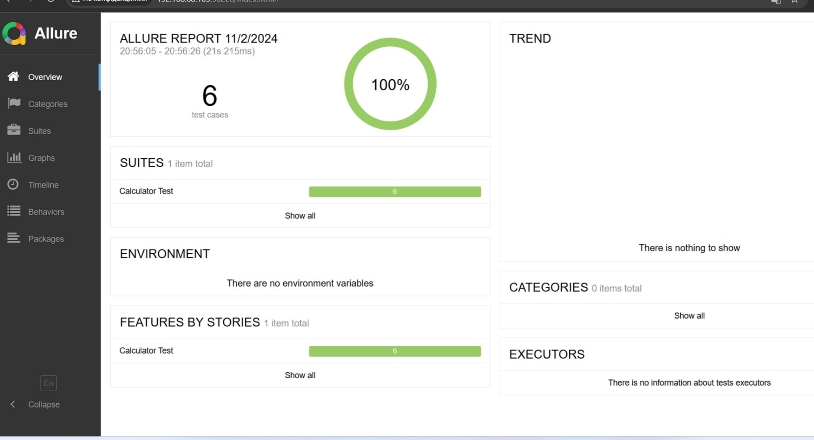
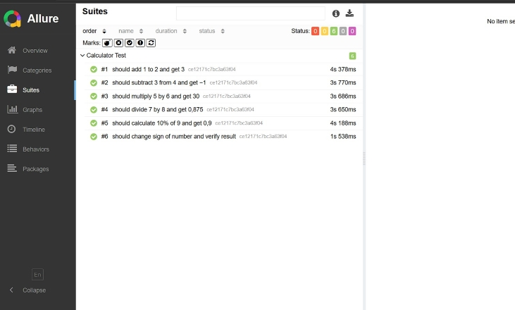

## Table of Contents
- [Overview](#overview)
- [Test Cases](#test-cases)
- [Test Results](#test-results)
- [Installation](#installation)
- [Usage](#usage)
- [Project Structure](#project-structure)
- [License](#license)

## Overview

This project is a test automation suite for an Android Calculator app using WebdriverIO and Appium. It is designed to validate the core functionalities of the Calculator app by performing end-to-end tests on various arithmetic operations. The tests are executed on BrowserStack to ensure compatibility across different devices and configurations. Additionally, tests were also conducted locally using Appium, with a Samsung S8 smartphone. Detailed test results are available through Allure reports for comprehensive analysis.

#### Requirements:

- Android Version: 9.0 (Pie).
- Calculator Version: 12.0.05.5.

#### Key Features:

- Automated tests for addition, subtraction, multiplication, division, percentage calculation, and sign change.
- Integration with BrowserStack for cross-device testing.
- Continuous Integration/Continuous Deployment (CI/CD) using GitHub Actions.
- Allure reports for detailed test result analysis.

## Test Cases

The following test cases are designed to validate the core functionalities of the Android Calculator app:

**Preconditions** 
- The Calculator app must be installed and running on the device

| **Test Case**                   | **Description**                                | **Steps**                                                                                                            |
|---------------------------------|------------------------------------------------|----------------------------------------------------------------------------------------------------------------------|
| **Addition Test**               | Adds 1 and 2 and verifies the result is 3      | 1. Clear the calculator.<br>2. Press 1.<br>3. Press the addition (+) button.<br>4. Press 2.<br>5. Press the equals (=) button.<br>6. Verify the result is 3. |
| **Subtraction Test**            | Subtracts 3 from 4 and verifies the result is 1| 1. Clear the calculator.<br>2. Press 4.<br>3. Press the subtraction (-) button.<br>4. Press 3.<br>5. Press the equals (=) button.<br>6. Verify the result is 1. |
| **Multiplication Test**         | Multiplies 5 by 6 and verifies the result is 30| 1. Clear the calculator.<br>2. Press 5.<br>3. Press the multiplication (*) button.<br>4. Press 6.<br>5. Press the equals (=) button.<br>6. Verify the result is 30. |
| **Division Test**               | Divides 8 by 2 and verifies the result is 4    | 1. Clear the calculator.<br>2. Press 8.<br>3. Press the division (/) button.<br>4. Press 2.<br>5. Press the equals (=) button.<br>6. Verify the result is 4. |
| **Percentage Calculation Test** | Calculates 10% of 90 and verifies the result is 9 | 1. Clear the calculator.<br>2. Press 1.<br>3. Press 0.<br>4. Press the percentage (%) button.<br>5. Press 9.<br>6. Press 0.<br>7. Press the equals (=) button.<br>8. Verify the result is 9. |
| **Change Sign Test**            | Changes the sign of the number and verifies the result | 1. Clear the calculator.<br>2. Press 5.<br>3. Press the plus/minus (±) button.<br>4. Verify the result is -5. |

## Test Results

The test automation suite was executed both locally using Appium and on BrowserStack for cross-device compatibility.

#### Allure Reports
Detailed test results, including screenshots and logs, are available through Allure reports. Below is a sample screenshot of the Allure report:


 

#### BrowserStack Public Link
Tests were also run on BrowserStack, and you can view the detailed results and logs through the following public link:
[BrowserStack Test Results](https://app-automate.browserstack.com/builds/b9f145c6e68df0bdc026ae505c03b75915846822/sessions/fe2dadcdb4569c97c8c4a247549a5d5303c972c2?auth_token=aaa32975e5253c47ab904f412f29d5c78a13285c7658b990e9e5b14e003510da)

## Installation

To get started with the project, follow these steps to set up your environment and install all necessary dependencies:

#### Clone the Repository:
   ```bash
   git clone https://github.com/gadiim/mobile_native_application_testing.git
   ```

#### Navigate to the project directory:
   ```bash
   cd mobile_native_application_testing
   ```
   
#### Install Dependencies:
   ```bash
   npm install
   ```

#### Download and Install the APK File:
   - Ensure you have the Calculator app APK file available.
   - You can either download your own APK file or use the provided APK file from [APKMirror](https://www.apkmirror.com/apk/samsung-electronics-co-ltd/calculator-samsung/calculator-samsung-12-0-05-5-release/).
   - > **Note:** The provided APK file works with the current project configuration. If you download a different APK file, you will need to update the project configuration to match the APK file's requirements.
   - If you're testing locally, install the APK on your Android device/emulator using the following command:
     ```bash
     adb install path/to/your/calculator.apk
     ```
   - Replace `path/to/your/calculator.apk` with the actual path to your APK file.

#### Set Up Environment Variables:
   - Create a `.env` file in the root of the project.
   - Add the following environment variables:
     ```plaintext
     BROWSERSTACK_USERNAME=your_browserstack_username
     ```
     ```plaintext
     BROWSERSTACK_ACCESS_KEY=your_browserstack_access_key
     ```
     ```plaintext
     BROWSERSTACK_ANDROID_APP_ID=your_browserstack_android_app_id
     ```

   - You can obtain these credentials from your BrowserStack account:
     - **BROWSERSTACK_USERNAME**: Log in to your [BrowserStack account](https://www.browserstack.com/), go to the **Profile** section, and copy your username.
     - **BROWSERSTACK_ACCESS_KEY**: In the same **Profile** section, copy your access key.
     - **BROWSERSTACK_ANDROID_APP_ID**: Upload your APK file to BrowserStack App Automate and copy the app ID from the upload page.

> #### Ensure Device Requirements:
>   - Verify the device meets the necessary requirements for testing.


## Usage
Follow these instructions to run the tests both locally and on BrowserStack.

   #### Running Tests Locally
   Ensure you have your device or emulator ready.
   ```bash
   npm run test
   ```

   #### Running Tests on BrowserStack
   Set up environment variables as described in the Installation section.
   ```bash
   npm run test:bs
   ```
   #### Generate Allure Reports
- Generate the Allure report after running the tests:
   ```bash
   npm run allure:generate
   ```

- Open the Allure report in your default web browser:
   ```bash
   npm run allure
   ```

## Project Structure
```sql
mobile_native_application_testing/
├── .github/
│   └── workflows/
│       └── ci.yml                    -- GitHub Actions CI workflow
├── config/
│   ├── wdio.conf.android.bs.ts       -- Configuration for BrowserStack
│   └── wdio.conf.android.ts          -- Local configuration
│   └── wdio.conf.ts                  -- Common WebdriverIO configuration
├── test/
│   ├── specs/
│   │   └── test.e2e.ts               -- End-to-end test cases for the calculator
│   └── pageobjects/
│       └── calculator.ts             -- Page object methods for the calculator
├── reporters/                        -- Directory for Allure and other reports
│   ├── allure-results/               -- Allure results
├── .gitignore                        -- Git ignore file
├── package.json                      -- Project dependencies and scripts
├── tsconfig.json                     -- TypeScript configuration
└── README.md                         -- Project documentation
```

### License

This project is licensed under the MIT License. You are free to use, modify, and distribute this project. See the [LICENSE](./LICENSE) file for more details.

```plaintext
MIT License

Permission is hereby granted, free of charge, to any person obtaining a copy of this software and associated documentation files (the "Software"), to deal in the Software without restriction, including without limitation the rights to use, copy, modify, merge, publish, distribute, sublicense, and/or sell copies of the Software, and to permit persons to whom the Software is furnished to do so, subject to the following conditions:

The above copyright notice and this permission notice shall be included in all copies or substantial portions of the Software.

THE SOFTWARE IS PROVIDED "AS IS", WITHOUT WARRANTY OF ANY KIND, EXPRESS OR IMPLIED, INCLUDING BUT NOT LIMITED TO THE WARRANTIES OF MERCHANTABILITY, FITNESS FOR A PARTICULAR PURPOSE AND NONINFRINGEMENT. IN NO EVENT SHALL THE AUTHORS OR COPYRIGHT HOLDERS BE LIABLE FOR ANY CLAIM, DAMAGES OR OTHER LIABILITY, WHETHER IN AN ACTION OF CONTRACT, TORT OR OTHERWISE, ARISING FROM, OUT OF OR IN CONNECTION WITH THE SOFTWARE OR THE USE OR OTHER DEALINGS IN THE SOFTWARE.
```

